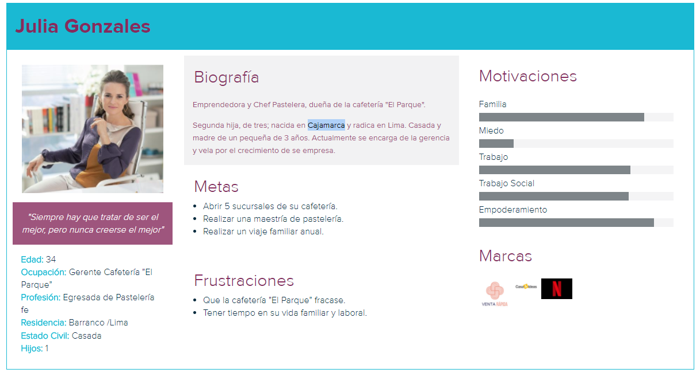
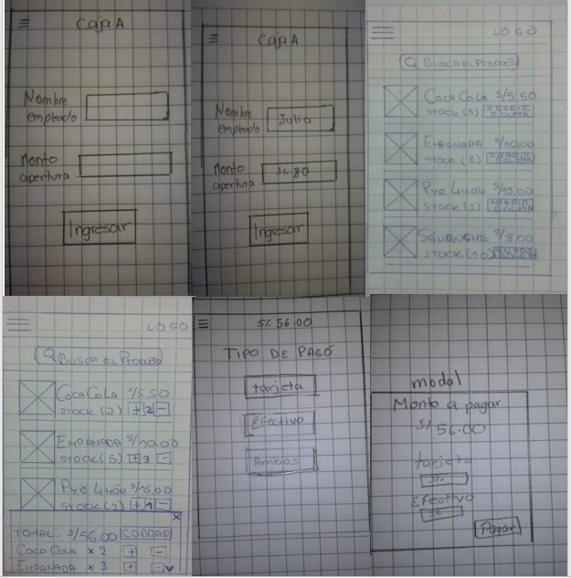
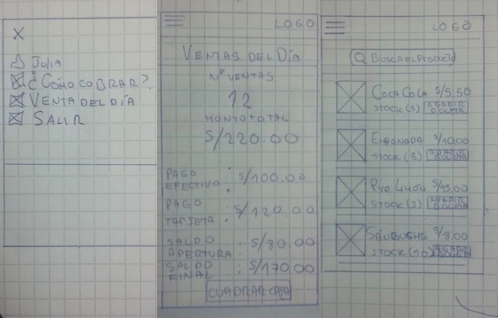
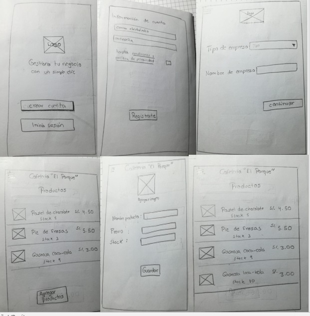
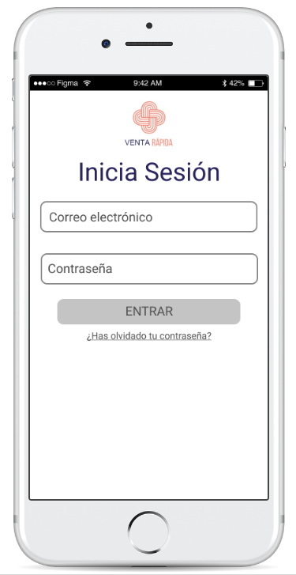
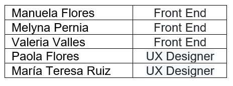

# Reto

Se tiene que  replicar la app de Square POS.

# Contexto

Este producto digital   consiste en   crear una app parecida a Square POS pero adaptada a las necesidades de nuestro país en términos de flujos, monedas e impuestos, y requerimientos de los usuarios. La aplicación móvil debe  permitir personalizar los productos con fotografías,nombres, precios gestionar artículos y empleados.

Esta aplicación fue probada en la cafeteria "El parque":

  * Julia, administradora de la cafetería, la usa para agregar y editar los productos de la cafetería, colocar el stock de cada producto, cargar una imagen referencial del      producto y colocar el precio de cada producto. Además de ingresar y editar la información del negocio (nombre / logo / dirección / sector de negocio / teléfono) . Y por     parte del rol empleado permite seleccionar los productos que se consumió ya sea uno solo o varios, cobrar y generar reporte de venta del día.

## Objetivos de la aplicación

EL objetivo principal de “Venta Rápida” es mejorar la usabilidad y rapidez en la que se realiza el manejo de cajas de una empresa; y mejorar la interacción entre el administrador del local y los empleados, optimizando los recursos para realizar una venta satisfactoria y eficaz.

Al tener  dos roles se tienen los siguientes objetivos por separado.

* EMPLEADO

    * Visibilidad del catálogo de productos con precios y stocks.
    * Realizar una boleta del pedido realizado por el cliente del negocio.
    * Cobros en efectivo y/o tarjeta de crédito.
    * Ingreso de saldo de apertura de la caja a utilizar.
    * Cuadre de caja al final del día.

* ADMINISTRADOR

    * Ingresar y editar de datos de la empresa.
    * Ingreso de las cajas asociadas al negocio.
    * Ingresar y modificar el catálogo de los productos (imagen referencia / precio / stock)
    * Cuadre de caja al final del día.

## Plan de investigación

  * LUNES
  
      * Recolección de información previa.
      * Análisis de la App y sitio Web de Square POS.
      * Ajuste de las necesidades principales a cubrir.
      * Definir las interacciones que contendrá nuestra App.
      * Realizar el prototipo en papel.

  * MARTES 

     * Realización del prototipo de alta fidelidad.
     * Testeo del prototipo.
     * Realización del README.

  * MIÉRCOLES 

     * Finalización del repositorio

# Idea de Negocio

Se creó  la aplicación móvil "Venta rápida" , la cual es  fácil de usar y ayuda a administrar cualquier tipo de negocio. Permite tener dos roles uno para el administrador del negocio y otra para los empleados, con diferentes funcionalidades en ambos roles.

# Objetivos del Plan de Investigación

* Conocer cómo mejorar, hacer más eficiente y adaptada a nuestro país a la App de Square POS
* Reconocer las necesidades de los negocios locales a la hora de realizar un cobro de sus productos y/o servicios.
* Encontrar los puntos clave que buscan los negocios al entrar a una plataforma digital.
* Saber qué desean como mínimo en la App.

## Entrevistas

Se realizó una entrevista en una cafetería. La persona a la que entrevistamos era la dueña y respondió las siguientes preguntas.

+ ¿Qué medio de pagos usas en tu negocio?

    Por lo general el medio de pagó es en efectivo, una que otra vez se paga con tarjeta de crédito o débito. 

* ¿Cuál es el promedio de tiempo que demora en realizar el cobro de tus productos?

    Dependiendo si el pago es en efectivo demoro en cotejar la cuenta, que la suma sea correcta y verificar lo que consumió el cliente. Aproximadamente demoro un par de minutos.
    En el pago de tarjeta es un poco más rápido, pero igual demoro en verificar lo que lleva el cliente. 

* ¿Cómo lleva un inventario de los productos que vende?

    Al finalizar el día hago mi cierre de caja, reviso las boletas de venta y veo que se vendió y lo voy anotando en mi cuaderno para saber la cantidad exacta.

* Cuéntame alguna mala experiencia que tuviste al vender un producto
    
    En algunas oportunidades se me acabó algún postre o bebida y el mozo no lo sabía, él ofreció cosas que no teníamos a los clientes y bueno todo terminaba en un mal rato y mi cafetería ganaba mal prestigio.

* Si tuvieras una aplicación móvil que te ahorre el tiempo de cobrar diversos productos de tu negocio, hacer inventarios, y               administrarlo. ¿Qué te gustaría que tenga?

    * Que ayude a saber que postres o bebidas están por terminar
    * Revisar las ventas realizadas por día, semana y mes.
    * Poder controlar la cantidad que vende cada mozo.
    * Llevar un inventario  de todo lo que tengo en la cafetería.

# Síntesis y definición

## User person

# Ideación

## Feature List

Rol del administrador:

  * Agregar  sus productos
  * Elimanr o editar cualquier producto ingresado
  * Revisar el stock de los productos
  * Visualizar y/o editar información de la empresa
  * Agregar número de cajas con las que trabajara.

Rol del empleado:

  * Colocar nombre del empleado
  * Visualizar el catálogo de los productos que tiene
  * Visualizar el stock de cada producto
  * Añadir productos a la venta
  * Realizar el cobro de la venta realizada
  
# Prototyping

## Prototipo en papel

Se testeó a 2 usarios, tomamos en cuenta sus observaciones para realizar un mejor prototipo digital

Flujo de empleado

Flujo de administrador

  

## Prototipo alta fidelidad

  Se logro testear a 1 alumno, nod dio importantes observaciones.

  
  
  Demo:

  https://marvelapp.com/872eh67

# Herramientas utilizadas

  * React
  * Redux
  * Figma
  * Marvel

# Equipo de trabajo

  
 
  

